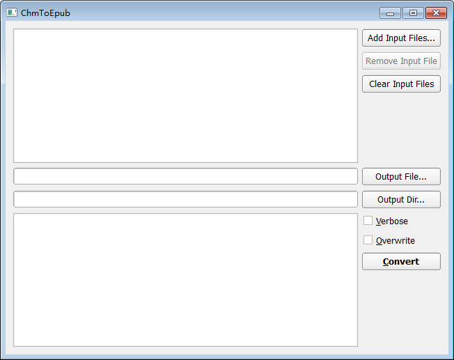

# ChmToEpub #

Crossplatform CLI & GUI tool for converting CHM files to EPUB files written in C++/Qt.

## The CLI tool ##

Usage:

	ChmToEpub <in_file> [out_file|out_dir] [-v] [-f]

Arguments:

	<in_file> = Input file, i.e. CHM file.
	[out_file|out_dir] = Output file, i.e. EPUB file. Or, output dir.
	-v | --verbose = Show in-process details.
	-f | --force-overwrite = Force overwrite output file if it exists.

## The GUI tool ##

Adds ease of use to the CLI tool.

